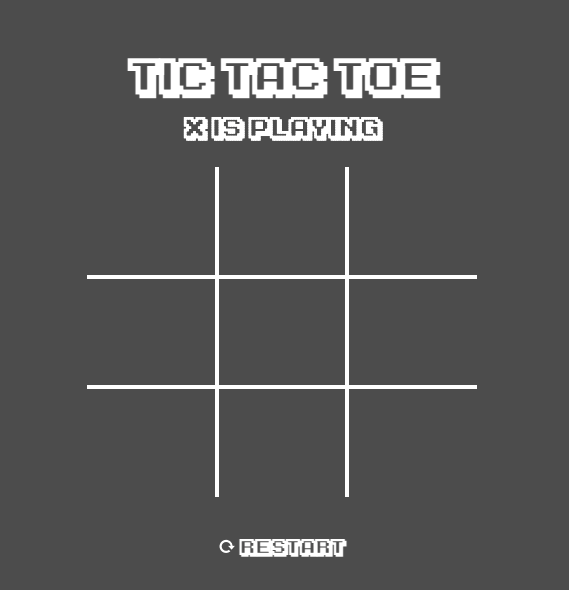

# Tic-tac-toe

> Work of Kevin from Batch 3

## Phase 1:
1. Create a game of tic tac toe.
2. The design and representation and responsiveness of the tic tac toe board in the DOM is up to you.
3. The rule of whose turn it is (X or O) must be observed. You can choose whether X or O will play first.
4. The "state" of the board should strictly come from a two-dimensional array (In JS, that's array within an array).
5. You may use array built-in methods.

## Phase 2:
1. When a player wins, you must show the history of the game.
- To do that, every move should be "saved".
2. Implement (2) buttons, "Previous" and "Next", that will show up when a game is done / finished.
3. When clicking "Previous" or "Next, the board should show the current move at that moment / turn.
- If there's no "next move", the next button must be disabled.
- If there's no "previous move", the previous button must be disabled.
 
4. Implement a reset button, that:
- Restarts the game
- Hides the "Previous" and "Next" buttons
- Clears move history
  
## Notes:
- Yes - refreshing the page clears the history of the game
- No - You cannot use any library like React etc. Although you can check them for references.
- No - You cannot use class(objects). Let's be "functional" for now!